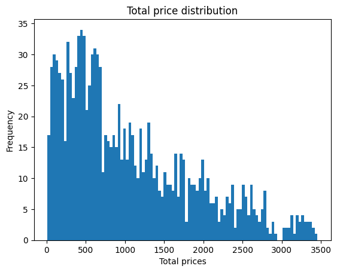
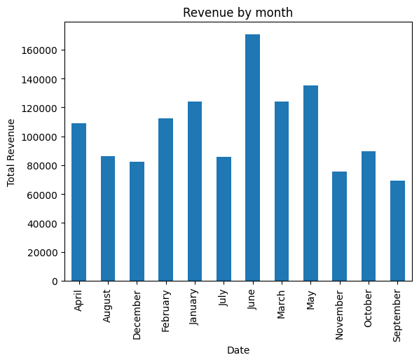
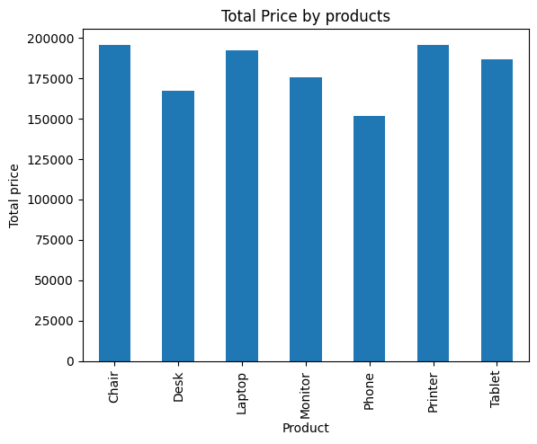
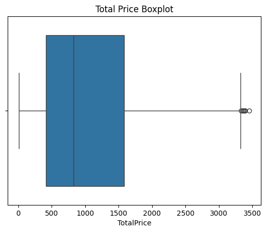
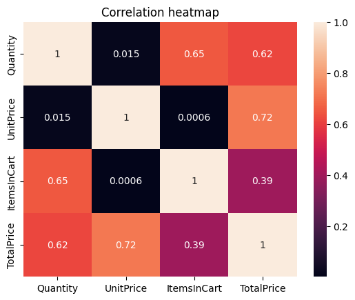

# Executive Summary

This project analyzes an e-commerce transaction dataset containing 1,200 orders to understand customer purchasing behavior, product performance, revenue trends, and marketing effectiveness.

After cleaning and exploring the dataset, several key patterns were identified. Customer spending was found to be strongly right-skewed, with a small number of bulk orders contributing significantly to total revenue. Chairs and Printers emerged as the highest-performing products, while Instagram generated the highest number of customer referrals. June recorded the highest monthly revenue, indicating a period of increased sales activity. Investigation of statistical outliers revealed that all high-value transactions were legitimate bulk purchases rather than abnormal or erroneous records.

The analysis also identified repeat customers within the dataset, with Customer C38840 generating the highest total expenditure. Based on these findings, recommendations include increasing inventory before high-demand periods, prioritizing stock for top-selling products, strengthening loyalty initiatives for high-value customers, and investing further in successful referral channels.

##Dataset Overview

Dataset Size:
- 1200 rows
- 14 columns

Key Features:
- OrderID
- CustomerID
- Product
- Quantity
- UnitPrice
- CouponCode
- ReferralSource
- TotalPrice
- Date

##Data Cleaning

- CouponCode contained 309 missing values.
- Missing coupon values were interpreted as orders without coupons and replaced with "No Coupon".
- Date column converted from string format to datetime format.
- Duplicate rows checked; no duplicate transactions found.
- Dataset inspected for illogical values; none were identified.

##Exploratory Data Analysis

A strongly right skewed distribution
- most orders are lower/moderate value
- a smaller number of orders are very expensive

- June recorded the highest monthly revenue
- Possibly influenced by seasonal demands, vacations or events

- A heavily right skewed distribution displaying the outliers

- Quantity and Unit Price showed a strong positive relationship with TotalPrice.

##Revenue Distribution

- TotalPrice distribution is strongly right-skewed.
- Mean TotalPrice exceeds median TotalPrice.
- A small number of high-value orders contribute disproportionately to revenue.

##Outlier Analysis

- Statistical outliers were identified between approximately 3400–3500.
- Investigation revealed these transactions were legitimate bulk orders rather than anomalies or errors.

##Customer Behavior

- Repeat customers were identified within the dataset.
- Customer C38840 generated the highest total spending (₹5723.23).

##Product Performance

- Tablets and Printers generated the highest sales volume.
- Chairs and Printers generated the highest sales revenue.

##Referral Analysis

- Instagram generated the highest number of referrals among all referral sources.

##Recommendations

1. Increase inventory levels for Chairs and Printers to meet observed demand.
2. Prepare additional inventory before June due to historically higher sales activity.
3. Consider implementing loyalty benefits for high-value customers such as Customer C38840.
4. Investigate successful Instagram campaigns and allocate additional marketing resources toward high-performing referral channels.
5. Analyze low-performing geographic areas and design targeted marketing campaigns to improve regional sales.